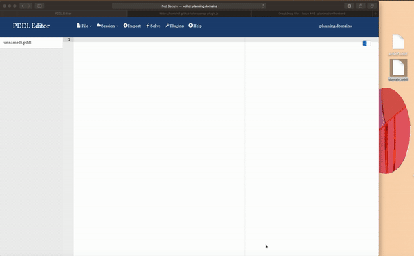

# drag-and-drop
Plugin to drag and drop file on the main window.\
It allows users to drag and drop files when the plugin is enabled. And it should prevent drag and drop when the plugin is disabled.\
It shows as below:\

